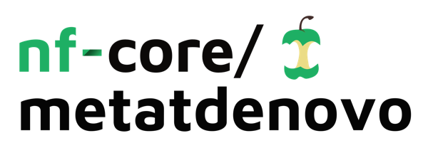

<h1>
  <picture>
    <source media="(prefers-color-scheme: dark)" srcset="docs/images/nf-core-metatdenovo_logo_dark.png">
    
  </picture>
</h1>

[](https://github.com/nf-core/metatdenovo/actions/workflows/ci.yml)
[](https://github.com/nf-core/metatdenovo/actions/workflows/linting.yml)[](https://nf-co.re/metatdenovo/results)[](https://doi.org/10.5281/zenodo.10666590)
[](https://www.nf-test.com)

[](https://www.nextflow.io/)
[](https://github.com/nf-core/tools/releases/tag/3.3.1)
[](https://docs.conda.io/en/latest/)
[](https://www.docker.com/)
[](https://sylabs.io/docs/)
[](https://cloud.seqera.io/launch?pipeline=https://github.com/nf-core/metatdenovo)

[](https://nfcore.slack.com/channels/metatdenovo)[](https://bsky.app/profile/nf-co.re)[](https://mstdn.science/@nf_core)[](https://www.youtube.com/c/nf-core)

## Introduction

**nf-core/metatdenovo** is a bioinformatics best-practice analysis pipeline for assembly and annotation of metatranscriptomic and metagenomic data from prokaryotes, eukaryotes or viruses.

On release, automated continuous integration tests run the pipeline on a full-sized dataset on the AWS cloud infrastructure. This ensures that the pipeline runs on AWS, has sensible resource allocation defaults set to run on real-world datasets, and permits the persistent storage of results to benchmark between pipeline releases and other analysis sources. The results obtained from the full-sized test can be viewed on the [nf-core website](https://nf-co.re/metatdenovo/results).

## Usage


1. Read QC ([`FastQC`](https://www.bioinformatics.babraham.ac.uk/projects/fastqc/))
2. Present QC for raw reads ([`MultiQC`](http://multiqc.info/))
3. Quality trimming and adapter removal for raw reads ([`Trim Galore!`](https://www.bioinformatics.babraham.ac.uk/projects/trim_galore/))
4. Optional: Filter sequences with [`BBduk`](https://jgi.doe.gov/data-and-tools/software-tools/bbtools/bb-tools-user-guide/bbduk-guide/)
5. Optional: Normalize the sequencing depth with [`BBnorm`](https://jgi.doe.gov/data-and-tools/software-tools/bbtools/bb-tools-user-guide/bbnorm-guide/)
6. Merge trimmed, pair-end reads ([`Seqtk`](https://github.com/lh3/seqtk))
7. Choice of de novo assembly programs:
   1. [`RNAspades`](https://cab.spbu.ru/software/rnaspades/) suggested for Eukaryote de novo assembly
   2. [`Megahit`](https://github.com/voutcn/megahit) suggested for Prokaryote de novo assembly
8. Choice of orf caller:
   1. [`TransDecoder`](https://github.com/TransDecoder/TransDecoder) suggested for Eukaryotes
   2. [`Prokka`](https://github.com/tseemann/prokka) suggested for Prokaryotes
   3. [`Prodigal`](https://github.com/hyattpd/Prodigal) suggested for Prokaryotes
9. Quantification of genes identified in assemblies:
   1. Generate index of assembly ([`BBmap index`](https://sourceforge.net/projects/bbmap/))
   2. Mapping cleaned reads to the assembly for quantification ([`BBmap`](https://sourceforge.net/projects/bbmap/))
   3. Get raw counts per each gene present in the assembly ([`Featurecounts`](http://subread.sourceforge.net)) -> TSV table with collected featurecounts output
10. Functional annotation:
    1. [`Eggnog`](https://github.com/eggnogdb/eggnog-mapper) -> Reformat TSV output "eggnog table"
    2. [`KOfamscan`](https://github.com/takaram/kofam_scan)
    3. [`HMMERsearch`](https://www.ebi.ac.uk/Tools/hmmer/search/hmmsearch) -> Ranking orfs based on HMMprofile with [`Hmmrank`](https://github.com/erikrikarddaniel/hmmrank)
11. Taxonomic annotation:
    1. [`EUKulele`](https://github.com/AlexanderLabWHOI/EUKulele) -> Reformat TSV output "Reformat_tax.R"
    2. [`CAT`](https://github.com/dutilh/CAT)
12. Summary statistics table. "Collect_stats.R"

## Usage

> [!NOTE]
> If you are new to Nextflow and nf-core, please refer to [this page](https://nf-co.re/docs/usage/installation) on how to set-up Nextflow. Make sure to [test your setup](https://nf-co.re/docs/usage/introduction#how-to-run-a-pipeline) with `-profile test` before running the workflow on actual data.

First, prepare a samplesheet with your input data that looks as follows:

`samplesheet.csv`:

```
| sample   | fastq_1                   | fastq_2
| -------- | ------------------------- | ------------------------- |
| sample1  | ./data/S1_R1_001.fastq.gz | ./data/S1_R2_001.fastq.gz |
| sample2  | ./data/S2_fw.fastq.gz     | ./data/S2_rv.fastq.gz     |
| sample3  | ./S4x.fastq.gz            | ./S4y.fastq.gz            |
| sample4  | ./a.fastq.gz              | ./b.fastq.gz              |
```

Each row represents a fastq file (single-end) or a pair of fastq files (paired-end).

Now, you can run the pipeline using:

```bash
nextflow run nf-core/metatdenovo \
   -profile <docker/singularity/.../institute> \
   --input samplesheet.csv \
   --outdir <OUTDIR>
```

> [!WARNING]
> Please provide pipeline parameters via the CLI or Nextflow `-params-file` option. Custom config files including those provided by the `-c` Nextflow option can be used to provide any configuration _**except for parameters**_; see [docs](https://nf-co.re/docs/usage/getting_started/configuration#custom-configuration-files).

For more details and further functionality, please refer to the [usage documentation](https://nf-co.re/metatdenovo/usage) and the [parameter documentation](https://nf-co.re/metatdenovo/parameters).

## Pipeline output

To see the results of an example test run with a full size dataset refer to the [results](https://nf-co.re/metatdenovo/results) tab on the nf-core website pipeline page.
For more details about the output files and reports, please refer to the
[output documentation](https://nf-co.re/metatdenovo/output).

> [!NOTE]
> Tables in `summary_tables` directory under the output directory are made especially for further analysis in tools like R or Python.

## Credits

nf-core/metatdenovo was originally written by Danilo Di Leo (@danilodileo), Emelie Nilsson (@emnilsson) & Daniel Lundin (@erikrikarddaniel).

## Contributions and Support

If you would like to contribute to this pipeline, please see the [contributing guidelines](.github/CONTRIBUTING.md).

For further information or help, don't hesitate to get in touch on the [Slack `#metatdenovo` channel](https://nfcore.slack.com/channels/metatdenovo) (you can join with [this invite](https://nf-co.re/join/slack)).

## Citations

If you use nf-core/metatdenovo for your analysis, please cite it using the following doi: [10.5281/zenodo.10666590](https://doi.org/10.5281/zenodo.10666590)

An extensive list of references for the tools used by the pipeline can be found in the [`CITATIONS.md`](CITATIONS.md) file.

You can cite the `nf-core` publication as follows:

> **The nf-core framework for community-curated bioinformatics pipelines.**
>
> Philip Ewels, Alexander Peltzer, Sven Fillinger, Harshil Patel, Johannes Alneberg, Andreas Wilm, Maxime Ulysse Garcia, Paolo Di Tommaso & Sven Nahnsen.
>
> _Nat Biotechnol._ 2020 Feb 13. doi: [10.1038/s41587-020-0439-x](https://dx.doi.org/10.1038/s41587-020-0439-x).
